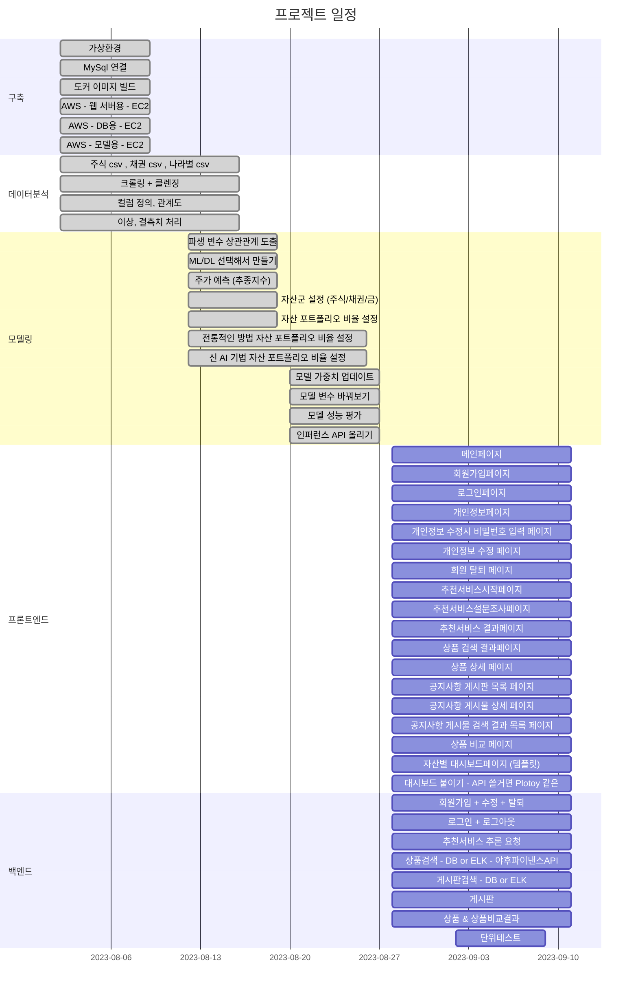

# 최종프로젝트 by 우리FIS 아카데미 1기 AI 엔지니어링
URL: https://youtu.be/WycMx2aSoEc?si=eh4dv55EmlsXPd0x
### 프로젝트 개요
- 주제: 투자자를 위한 인공지능 포트폴리오 전략 제안 서비스
- 기간: 2023.08.04 ~ 2023.09.19
- 팀원: 6명
### 요구사항 정의서
| 요구사항 번호         | 요구사항 명칭                                      | 요구사항 내용                                                        | 제약사항                                    | 중요도               | 해결방안                                    | 검수기준                          |
| --------------- | -------------------------------------------- | -------------------------------------------------------------- | --------------------------------------- | ----------------- | --------------------------------------- | ----------------------------- |
| 구현-1            | 회원가입/인증인가                                    | ID/PW 설정                                                       | ID : 영문 5자 이상 PW 대,소문자,기호 10자 이상     | 하                 | 제약사항을 바탕으로 로그인 기능 추가                 | 정규표현식과 분기문을 활용한 제약사항 준수 확인 |
| 구현-2            | 정보검색                                         | 일반 상품 검색                                                       | 공백 검색x 빈번한 오타에 대한 처리 페이지네이션 - 10개 | 하                 | 텍스트 분석 기법 활용 해시테이블 활용 매칭          | 제약사항대로 정상동작 확인                |
| 구현-3            | 게시판 검색                                       | 공지사항 게시판 구축                                                    | 사용자가 작성불가능                              | 하                 | 관리자 인가를 통한 게시물 작성                       | 검색된 제목의 키워드와 내용물 간 정상 매칭 확인   |
| 구현-3            | 게시판 검색                                       | 공지사항 게시물 키워드 검색 | 제목의 키워드 제한 다른 페이지로 넘어가도 공지사항이 사라지지 않도록 | 하                                                              | 페이지네이션 구현                               | 게시판 목록 정상동작 확인 |
| 구현-4            | 추천기능                                         | 인공지능 모델 사용                                                     | 시계열 데이터 사용                              | 상                 | 시계열 데이터에 최적화된 모델인지 확인                | 모델 성능 확인                      |
| 구현-4            | 추천기능                                         | 사전 설문조사         | \- 투자성향 5개 \- 질문지 20개                     | 중                                                              | 사전 설문을 통해 수요파악                          | 군집화 확인            |
| 구현-4            | 추천기능                                         | 포트폴리오 추천        | 자산군 6가지 이상                                   | 상                                                              | 데이터 수집을 통해                              | 백테스팅 결과 확인        |
| 구현-5            | 사용자 정보                                       | 회원정보 수정                                                        | PW 확인 후 변경가능                            | 하                 | 제약사항을 바탕으로 수정기능 추가                      | 회원 정보 수정 완료                   |
| 구현-5            | 사용자 정보                                       | 회원 탈퇴           | PW 확인 후 탈퇴가능                                 | 하                                                              | 제약사항을 바탕으로 탈퇴기능 추가                      | 회원 탈퇴 완료          |
| 구현-6            | MLOps                                        | 데이터 파이프라인을 활용한 모델서빙                                         | 성능 속도 안정 데이터 정합성                     | 상                 | python 기반 웹프레임워크 사용 MLflow같은 tool 고려 | 로그 확인                         |
| 구현-7            | 인공지능모델                                       | 추천서비스 알고리즘 설계                                                  | 평가지표 일정 성능 이상 확보                        | 상                 | 변동성, 샤프지수 등 활용 성능 평가 및 학습 반복         | 평가지표 성능 확보 여부 확인              |
| 구현-8            | 피쳐엔지니어링                                      | 데이터 전처리                                                        | 이상치, NULL 값 처리 (기준)                     | 중                 | 산술평균 활용                                 | isnull, isnan로 확인             |
| 구현-9            | 개발환경구축                                       | 파이썬 가상 환경 구축                                                   | 파이썬 버전 및 라이브러리 통일                       | 중                 | 도커이미지 활용                                | 동일 버전인지 확인                    |
| 구현-10           | 인프라구축                                        | 클라우드에 DB와 학습 환경 연결 & DB와 화면단 연결                         | CI/CD 연결 웹서버 추론api db 용 서버     | 중                 | aws 사용                                  | 연결 여부 확인                      |
| 구현-11           | 상품비교                                         | 포트폴리오 상품 비교                                                    | 상품 1개씩 따로 선택 가능                         | 상                 | 상품 1개 선택 시 이후에 다시 상품 1개 선택 완료되면 비교됨  | 상품 비교 페이지 정상동작 확인             |
| 구현-12           | 대시보드                                         | 투자성향별 포트폴리오 확인                                                 | 시각 요소의 동적 반응                            | 상                 | 파이차트 활용                                 | 성향별 대시보드 변화 여부 확인             |
| 구현-13           | 외부api 활용                                     | 주가 데이터 수집 사용자 화면 출력                                         | 유료api 가격 제한 사용자 화면에서의 데이터 보호         | 상                 | FinanceDataReader 패키지 활용                | 연결 확인 및 대시보드 정상동작             |
| 구현-14           | 포트폴리오 전략                                     | 전통적인 포트폴리오전략과 그 외의 포트폴리오 전략 제시 주식, 채권, 대안자산을 세분화하여 투자상품군 구성 | 3개 이상 포트폴리오 구성                          | 상                 | 블랙 리터만 모델 활용 및 새로운 알고리즘 설계           | 차별점 확인                        |

### WBS

